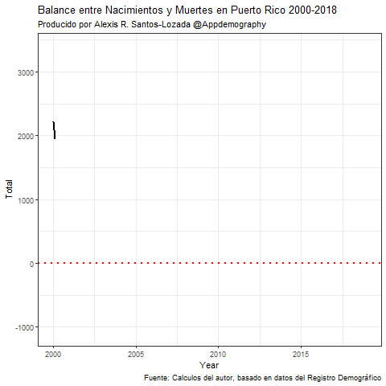
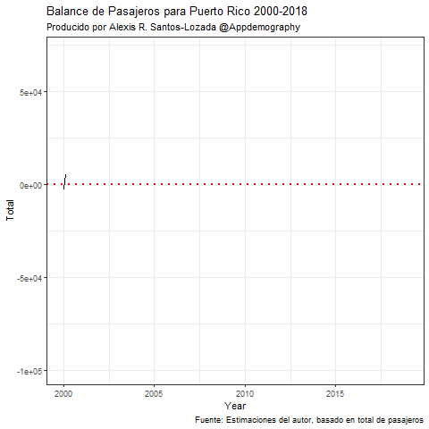
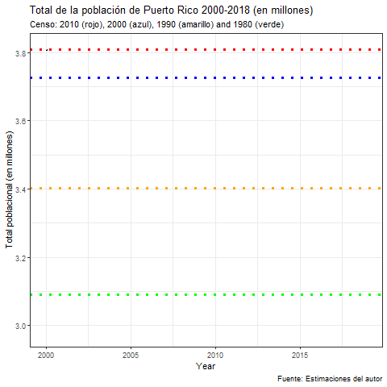
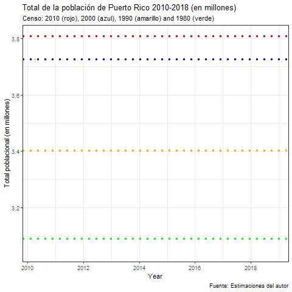

# Introducción
Este repositorio continue los datos y el código utilizado para crear las cuatro animaciones presentadas en este repositorio. 
Estas animaciones fueron presen

# Nacimientos y Muertes 

# Migración Neta

# Estimaciones Mensuales 2000-2018
## Partiendo desde el 2000

# Estimaciones Mensuales 2010-2018
## Partiendo desde el 2010

